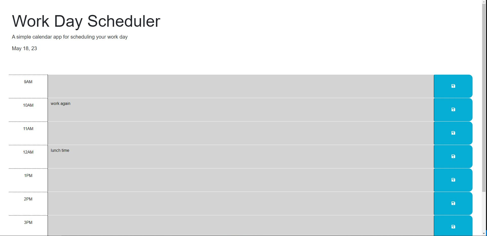

# work-planner

## Description
This is a work planner or just a planner you can use to plan your current day, for those who have a busy day!
-there are many individuals who have packed scheduels and this will help organize this 
-this project was built because its a simple application you can use to plan your day out 
-this solves the issue of potentially forgetting what is next on your To Do list
-I was able to further understand jquery and how to use it for the application

## Usage
Simply add your tasks to the planner and hit save, so the next time you reference your schedule its able to be reloaded and depending on the time of the daya and the event it will appear either red (present)  green (future) grey (past)\

## Credits
Eric Sayer, a tutor that guided me with this project
## License 
please refer to the repo